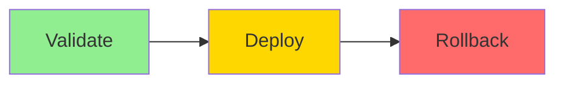

# GitLab CI/CD Pipeline Guide

## 📋 Overview

This guide explains how to use the GitLab CI/CD pipeline for database migrations with Liquibase.

## 🏗️ Pipeline Architecture

### Pipeline Stages



### Stage Details

| Stage | Purpose | Trigger | Duration |
|-------|---------|---------|----------|
| **Validate** | Verify changelog syntax and check status | Automatic on MR, main, develop | 1-2 min |
| **Deploy** | Tag DB state and apply migrations | Manual approval required | 2-5 min |
| **Rollback** | Revert to previous tagged state | Manual trigger only | 2-5 min |

## 🚀 Using the Pipeline

### 1. Validation Stage (Automatic)

**When it runs:**
- On every merge request
- On pushes to `main` or `develop` branches

**What it does:**
```bash
# Validates changelog syntax
liquibase validate

# Shows pending changes
liquibase status --verbose
```

**Success Criteria:**
- ✅ All changelog files are valid XML/SQL
- ✅ No syntax errors in changesets
- ✅ All referenced files exist

**If validation fails:**
1. Check the error message in pipeline logs
2. Fix the changeset syntax
3. Commit and push the fix
4. Pipeline will re-run automatically

### 2. Deploy Stage (Manual)

**When to trigger:**
- After validation passes
- When you're ready to apply changes to database

**How to deploy:**

1. **Navigate to Pipeline:**
   ```
   GitLab → CI/CD → Pipelines → [Your Pipeline]
   ```

2. **Review Changes:**
   - Check validation stage output
   - Review what changes will be applied
   - Verify you're deploying to correct environment

3. **Trigger Deployment:**
   - Click on "deploy_database" job
   - Click the ▶️ "Play" button
   - Confirm you want to proceed

4. **Monitor Deployment:**
   - Watch the live log output
   - Verify each step completes successfully
   - Note the pipeline ID (used for rollback)

**What it does:**
```bash
# 1. Tag current database state
liquibase tag $CI_PIPELINE_ID

# 2. Show pending changes
liquibase status --verbose

# 3. Apply migrations
liquibase update

# 4. Confirm success
```

**Success Indicators:**
- ✅ Tag created successfully
- ✅ All changesets applied
- ✅ No errors in logs
- ✅ "Deployment completed successfully" message

### 3. Rollback Stage (Manual)

**When to use:**
- If deployment causes issues
- If you need to revert changes
- For emergency rollback scenarios

**How to rollback:**

1. **Navigate to Original Pipeline:**
   ```
   GitLab → CI/CD → Pipelines → [Pipeline that deployed changes]
   ```

2. **Preview Rollback:**
   - Review the rollback SQL in job logs
   - Verify it will revert expected changes
   - Confirm with team if needed

3. **Execute Rollback:**
   - Click on "rollback_database" job
   - Click the ▶️ "Play" button
   - Monitor the rollback process

**What it does:**
```bash
# 1. Show rollback SQL (preview)
liquibase rollback-sql $CI_PIPELINE_ID

# 2. Execute rollback
liquibase rollback $CI_PIPELINE_ID

# 3. Confirm success
```

**Success Indicators:**
- ✅ Rollback SQL looks correct
- ✅ All rollback statements execute
- ✅ Database returns to previous state
- ✅ "Rollback completed successfully" message

## 🔧 Environment Configuration

### Required GitLab CI/CD Variables

Navigate to: **Settings → CI/CD → Variables**

| Variable | Description | Protected | Masked |
|----------|-------------|-----------|--------|
| `DB_HOST` | Database server hostname | ✅ | ✅ |
| `DB_PORT` | Database port (usually 5432) | ✅ | ❌ |
| `DB_NAME` | Database name | ✅ | ❌ |
| `DB_USER` | Database username | ✅ | ✅ |
| `DB_PASS` | Database password | ✅ | ✅ |

**Configuration Tips:**
- Mark as **Protected** to only use on protected branches
- Mark as **Masked** to hide values in logs
- Don't expand variables (uncheck "Expanded")
- Use different values for each environment

### Multiple Environments

**For multiple environments**, use different variable sets:

**Production:**
```
DB_HOST_PROD=prod-db.example.com
DB_USER_PROD=prod_user
DB_PASS_PROD=prod_password
```

**Staging:**
```
DB_HOST_STAGING=staging-db.example.com
DB_USER_STAGING=staging_user
DB_PASS_STAGING=staging_password
```

Then modify pipeline to use environment-specific variables.

## 📊 Pipeline Monitoring

### What to Monitor

**During Deployment:**
- Log output for errors or warnings
- SQL statements being executed
- Number of changesets applied
- Database locks or timeouts
- Overall execution time

**After Deployment:**
- Application functionality
- Database performance
- Error logs
- User reports

### Key Log Messages

**Success Messages:**
```
✅ "Tagging current database state with tag: 12345"
✅ "Liquibase command 'tag' was executed successfully"
✅ "Pending changes to be applied:"
✅ "Liquibase command 'update' was executed successfully"
✅ "Deployment completed successfully for pipeline 12345"
```

**Warning Messages:**
```
⚠️ "Changeset already ran"  # Usually OK, means idempotent
⚠️ "Lock table not found"   # May need to initialize
```

**Error Messages:**
```
❌ "Connection refused"                    # Check DB connectivity
❌ "Authentication failed"                 # Check credentials
❌ "Syntax error"                         # Fix SQL in changeset
❌ "Table already exists"                 # Missing IF NOT EXISTS
❌ "Could not acquire change log lock"    # Another process running
```

## 🐛 Troubleshooting

### Common Issues and Solutions

#### Issue 1: Validation Fails

**Symptom:**
```
ERROR: Syntax error in changelog file
```

**Solution:**
1. Check the specific file mentioned in error
2. Validate XML/SQL syntax
3. Ensure all included files exist
4. Fix and commit changes

#### Issue 2: Connection Refused

**Symptom:**
```
ERROR: Connection refused to jdbc:postgresql://host:5432/db
```

**Solution:**
1. Verify `DB_HOST` variable is correct
2. Check network connectivity
3. Verify firewall rules allow connection
4. Confirm database is running

#### Issue 3: Authentication Failed

**Symptom:**
```
ERROR: Authentication failed for user
```

**Solution:**
1. Verify `DB_USER` and `DB_PASS` variables
2. Check user has required permissions
3. Verify password hasn't expired
4. Test connection manually: `psql -h $DB_HOST -U $DB_USER -d $DB_NAME`

#### Issue 4: Changeset Already Ran

**Symptom:**
```
ERROR: Changeset already ran: author:changesetId
```

**Solution:**
- **If expected:** This is usually OK, changeset is idempotent
- **If not expected:** You may have modified an executed changeset
  - Never modify executed changesets!
  - Create a new changeset to make changes

#### Issue 5: Lock Table Error

**Symptom:**
```
ERROR: Could not acquire change log lock
```

**Solution:**
1. Check if another Liquibase process is running
2. Wait for other process to complete
3. If stuck, manually release lock:
   ```sql
   DELETE FROM databasechangeloglock WHERE locked = TRUE;
   ```
4. Retry deployment

#### Issue 6: Rollback Fails

**Symptom:**
```
ERROR: No tag found: 12345
```

**Solution:**
1. Verify the tag exists: `liquibase history`
2. Check you're using the correct pipeline ID
3. Ensure database hasn't been manually modified
4. May need to manually revert changes

#### Issue 7: Pipeline Times Out

**Symptom:**
```
ERROR: Job exceeded timeout
```

**Solution:**
1. Check for long-running queries
2. Review changesets for efficiency
3. Consider batching large data migrations
4. Increase job timeout if necessary

### Debug Mode

To enable detailed logging, add to pipeline:

```yaml
variables:
  LIQUIBASE_LOG_LEVEL: DEBUG
```

Then check logs for detailed SQL and operations.

## 📋 Deployment Checklist

### Pre-Deployment

- [ ] Changes reviewed and approved
- [ ] Validation stage passed
- [ ] Database backup completed
- [ ] Rollback plan prepared
- [ ] Stakeholders notified (if needed)
- [ ] Off-hours scheduled (for large changes)
- [ ] Emergency contacts available

### During Deployment

- [ ] Monitor pipeline logs in real-time
- [ ] Watch for errors or warnings
- [ ] Verify each step completes successfully
- [ ] Note the pipeline ID for rollback
- [ ] Take screenshots if issues occur

### Post-Deployment

- [ ] Verify application functionality
- [ ] Check database performance
- [ ] Review application logs
- [ ] Monitor user reports
- [ ] Document any issues encountered
- [ ] Update team on status

## 🎯 Best Practices

### DO's ✅

1. **Always review validation output** before deploying
2. **Monitor deployments in real-time** - don't walk away
3. **Test changes in staging first**
4. **Communicate with team** before production deployments
5. **Keep pipeline ID handy** for potential rollback
6. **Document unusual situations** in deployment log
7. **Verify application works** after deployment

### DON'Ts ❌

1. **Don't deploy without validation passing**
2. **Don't deploy during peak hours** (for major changes)
3. **Don't skip the review process**
4. **Don't modify executed changesets**
5. **Don't deploy if unsure** - ask for help
6. **Don't ignore warnings** - investigate them
7. **Don't bypass manual approval gates**

## 📈 Pipeline Metrics

Track these metrics to improve your process:

- **Validation Success Rate**: Should be >95%
- **Deployment Frequency**: Track how often you deploy
- **Deployment Duration**: Monitor for increases
- **Rollback Frequency**: Should be <5%
- **Failed Deployments**: Investigate each failure

## 🆘 Emergency Procedures

### If Deployment Causes Critical Issue

1. **Immediate Response:**
   ```bash
   # Option 1: Rollback via pipeline
   Navigate to pipeline → Click "rollback_database" → Play
   
   # Option 2: Manual rollback (if pipeline unavailable)
   liquibase --classpath=driver.jar \
     --defaultsFile=liquibase.properties \
     rollback TAG_NAME
   ```

2. **Verify Rollback:**
   - Check application functionality
   - Review database state
   - Confirm issues resolved

3. **Post-Incident:**
   - Document what happened
   - Review what went wrong
   - Update procedures to prevent recurrence

### If Pipeline Is Down

**Manual deployment process:**

```bash
# 1. Connect to deployment server
ssh deployment-server

# 2. Set environment variables
export DB_HOST=your_host
export DB_USER=your_user
export DB_PASS=your_password
# ... other variables

# 3. Run Liquibase manually
liquibase --classpath=postgresql-42.7.8.jar \
  --changeLogFile=db.changelog-master.xml \
  --url=jdbc:postgresql://$DB_HOST:5432/$DB_NAME \
  --username=$DB_USER \
  --password=$DB_PASS \
  update
```

## 📞 Support

**For pipeline issues:**
- Check this guide first
- Review pipeline logs
- Contact DevOps team
- Open incident ticket if critical

**Escalation Path:**
1. Team Lead
2. DevOps Team
3. Database Administrator
4. On-Call Engineer (for emergencies)

---

**Remember**: When in doubt, don't deploy. Ask for help!