# Developer Workflow Diagram

This diagram illustrates the complete developer workflow when working with Liquibase in this project.

```mermaid
flowchart TB
    Start([Developer Starts Work]) --> Checkout[Checkout develop branch]
    Checkout --> CreateBranch[Create feature branch<br/>feature/your-feature-name]
    
    CreateBranch --> DetermineType{Determine<br/>Object Type}
    
    DetermineType -->|Table| CreateTable[Create SQL in<br/>objects/tables/]
    DetermineType -->|Stored Proc| CreateSP[Create SQL in<br/>objects/sp/]
    DetermineType -->|View| CreateView[Create SQL in<br/>objects/views/]
    
    CreateTable --> FormatSQL1[Format SQL:<br/>1. --liquibase formatted sql<br/>2. --changeset author:id labels context runOnChange<br/>3. --comment<br/>4. SQL code<br/>5. --rollback]
    CreateSP --> FormatSQL2[Format SQL:<br/>1. --liquibase formatted sql<br/>2. --changeset author:id labels context runOnChange:true<br/>3. --comment<br/>4. SQL code<br/>5. --rollback]
    CreateView --> FormatSQL3[Format SQL:<br/>1. --liquibase formatted sql<br/>2. --changeset author:id labels context runOnChange:true<br/>3. --comment<br/>4. SQL code<br/>5. --rollback]
    
    FormatSQL1 --> UpdateXML1[Update objects/tables.xml<br/>Add include reference]
    FormatSQL2 --> UpdateXML2[Update objects/sp.xml<br/>Add include reference]
    FormatSQL3 --> UpdateXML3[Update objects/views.xml<br/>Add include reference]
    
    UpdateXML1 --> Commit
    UpdateXML2 --> Commit
    UpdateXML3 --> Commit
    
    Commit[Commit changes<br/>git add & git commit] --> Push[Push to feature branch<br/>git push origin feature/...]
    
    Push --> CreatePR[Create Pull Request<br/>to develop branch]
    
    CreatePR --> LintStage[Lint Stage Triggers<br/>Automatically]
    
    subgraph LintStage[Lint Stage - Automatic]
        direction TB
        Validate[liquibase_validate<br/>- Validate changelog syntax<br/>- Check DB connection<br/>- Show status]
        Checks[liquibase_checks<br/>- Run quality checks<br/>- Generate update-sql preview<br/>- Create reports]
        Validate --> Checks
    end
    
    LintStage --> LintSuccess{Lint<br/>Passed?}
    
    LintSuccess -->|No| FixErrors[Fix validation errors<br/>Push updates]
    FixErrors --> LintStage
    
    LintSuccess -->|Yes| CodeReview[Code Review Process]
    
    CodeReview --> Approved{PR<br/>Approved?}
    
    Approved -->|No| MakeChanges[Make requested changes<br/>Push updates]
    MakeChanges --> LintStage
    
    Approved -->|Yes| MergePR[Merge PR to develop branch]
    
    MergePR --> DeployStage[Deploy Stage Available]
    
    subgraph DeployStage[Deploy Stage - Manual Approval]
        direction TB
        WaitApproval[Wait for Manual Approval]
        TagDB[Tag Database State<br/>with pipeline ID]
        ApplyChanges[Apply Database Changes<br/>liquibase update]
        WaitApproval --> TagDB --> ApplyChanges
    end
    
    DeployStage --> DeploySuccess{Deploy<br/>Success?}
    
    DeploySuccess -->|No| RollbackStage
    
    subgraph RollbackStage[Rollback Stage - Manual]
        direction TB
        StandardRB[Standard Rollback<br/>to previous pipeline tag]
        CustomRB[Custom Rollback<br/>with specific options]
    end
    
    DeploySuccess -->|Yes| Complete([✓ Deployment Complete])
    
    RollbackStage --> Complete
    
    style LintStage fill:#e1f5ff,stroke:#0366d6,stroke-width:2px
    style DeployStage fill:#dcffe4,stroke:#28a745,stroke-width:2px
    style RollbackStage fill:#fff3cd,stroke:#ffc107,stroke-width:2px
    style Start fill:#f0f0f0,stroke:#333,stroke-width:2px
    style Complete fill:#d4edda,stroke:#28a745,stroke-width:3px
    style DetermineType fill:#fff3cd,stroke:#ffc107,stroke-width:2px
    style LintSuccess fill:#fff3cd,stroke:#ffc107,stroke-width:2px
    style Approved fill:#fff3cd,stroke:#ffc107,stroke-width:2px
    style DeploySuccess fill:#fff3cd,stroke:#ffc107,stroke-width:2px
```

## Workflow Steps Explained

### 1. Setup Phase
- Start from `develop` branch
- Create a feature branch for your work

### 2. Development Phase
- Determine the type of database object (Table, SP, or View)
- Create SQL file in appropriate folder:
  - `objects/tables/` for tables
  - `objects/sp/` for stored procedures
  - `objects/views/` for views
- Format SQL with Liquibase headers
- Update corresponding XML file (tables.xml, sp.xml, or views.xml)

### 3. Git Workflow
- Commit changes with meaningful message
- Push to your feature branch
- Create Pull Request to `develop`

### 4. CI/CD Pipeline - Lint Stage (Automatic)
Runs automatically on push, PR, and MR:
- **liquibase_validate**: Validates changelog syntax and DB connection
- **liquibase_checks**: Runs quality checks and generates SQL preview
- Shows validation results in PR

If lint fails:
- Review error messages in pipeline logs
- Fix issues locally
- Push updates (lint runs again automatically)

### 5. Code Review
- Team members review your PR
- Address feedback if needed
- Get approval

### 6. Merge to Develop
- PR is merged to `develop` branch
- Deploy stage becomes available

### 7. CI/CD Pipeline - Deploy Stage (Manual Approval)
Only runs on `develop` branch with manual trigger:
- Requires approval from authorized person
- Tags current database state with pipeline ID
- Applies database changes using Liquibase update

### 8. Post-Deployment
If deployment succeeds:
- ✓ Changes are live in the database
- Tag is created for potential rollback

If deployment fails:
- Rollback options available:
  - **Standard Rollback**: Quick rollback to previous pipeline tag
  - **Custom Rollback**: Flexible rollback with custom parameters

## Key Points

- **Lint runs automatically** on every push and PR
- **Deploy requires manual approval** for safety
- **Rollback is always available** after deployment
- **Use runOnChange:true** for stored procedures and views
- **Always include rollback statements** in your SQL
- **Follow naming conventions** for consistency

## Quick Reference

| Stage | Trigger | Purpose |
|-------|---------|---------|
| Lint | Automatic (push/PR/MR) | Validate changes before merge |
| Deploy | Manual (develop branch) | Apply changes to database |
| Rollback | Manual (after deploy) | Revert changes if needed |
