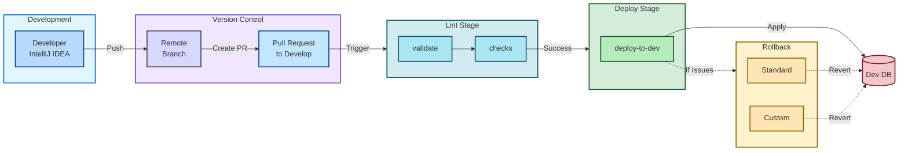

# Architecture Diagram - Liquibase CI/CD Pipeline

## High-Level Architecture Overview

This document provides a high-level architecture diagram of the Liquibase CI/CD pipeline with rollback capabilities.

## Pipeline Stages Breakdown

### 1. **Development**
   - **Developer (IntelliJ IDEA)**: Creates and tests database changes locally
   - **Remote Branch**: Feature or developer branch in Git

### 2. **Version Control**
   - **Pull Request**: Opens PR to develop branch
   - **Triggers**: GitLab CI/CD pipeline automatically starts

### 3. **Lint Stage** (Automated)
   - **validate**: Validates changelog syntax and database connection (liquibase-validate)
   - **checks**: Runs quality checks and best practices (liquibase-checks)
   - Runs automatically on all pipeline triggers

### 4. **Deploy Stage** (Automated after Lint Success)
   - **deploy-to-dev**: Deploys database changes to development environment (liquibase-deploy-to-dev)
   - Creates a tag using `$CI_PIPELINE_ID`
   - Generates SQL preview and executes update
   - Applies changes to Dev Database

### 5. **Rollback** (Manual - If Issues Found)
   - **Standard**: Quick rollback to previous pipeline tag
   - **Custom**: Flexible rollback with 5 strategies:
     - Tag + Label: Rollback to specific tag with label filter
     - Tag only: Rollback to specific tag
     - Count Based: Rollback N changesets
     - Date Based: Rollback to specific date
     - SQL Preview: Generate rollback SQL without executing

## Workflow

**Diagram Flow Explanation:**

1. **Developer (IntelliJ IDEA)** → Creates and tests database changes locally
2. **Push Changes** → Pushes to remote feature/developer branch
3. **Create Pull Request** → Opens PR to develop branch in GitLab
4. **Triggers Pipeline** → GitLab CI/CD automatically starts
5. **Lint Stage** → Automated validation:
   - `liquibase-validate`: Checks connection and validates changelog
   - `liquibase-checks`: Runs quality checks and best practices
6. **Deploy Stage** → Automated deployment (on lint success):
   - `liquibase-deploy-to-dev`: Tags deployment and applies changes
7. **Database** → Changes applied to development database
8. **Rollback Stage** → Manual trigger if needed:
   - Standard Rollback: Quick revert to previous tag
   - Custom Rollback: Flexible options (tag, label, count, date, SQL preview)

## Key Features

- **Automated Validation**: Every PR triggers validation and checks
- **Tagging Strategy**: Each deployment creates a tag for easy rollback
- **Multiple Rollback Options**: Standard and custom rollback strategies
- **Environment Progression**: Designed for dev → cert → prod workflow
- **Manual Safety**: Rollback operations require manual approval
- **Flexible Custom Rollback**: Support for tag-based, count-based, date-based, and SQL-only rollbacks

## Environment Variables

### Standard Variables (per environment)
- `database_server`: Database server hostname
- `database_name`: Database name
- `database_username`: Database username
- `database_password`: Database password
- `database_type`: Type of database (azure_sql, mssql, postgresql)
- `env_context`: Environment context (dev, cert, prod)

### Custom Rollback Variables
- `RB_TAG`: Target tag for rollback (optional)
- `RB_LABEL`: Label filter for selective rollback (optional)
- `RB_CMD`: Custom Liquibase command for advanced rollback scenarios (optional)

## Usage Examples

### Standard Rollback
Simply trigger the `liquibase-rollback-from-dev` job manually from GitLab CI.

### Custom Rollback - By Tag and Label
1. Set variables in GitLab:
   - `RB_TAG`: "12345" (pipeline ID or custom tag)
   - `RB_LABEL`: "feature-x"
2. Trigger `liquibase_custom_rollback` job manually

### Custom Rollback - By Count
1. Set variables in GitLab:
   - `RB_CMD`: "rollbackCount 3"
2. Trigger `liquibase_custom_rollback` job manually

### Custom Rollback - By Date
1. Set variables in GitLab:
   - `RB_CMD`: "rollbackToDate 2025-01-15"
2. Trigger `liquibase_custom_rollback` job manually

### Generate Rollback SQL Only
1. Set variables in GitLab:
   - `RB_CMD`: "rollbackSQL <tag>"
2. Trigger `liquibase_custom_rollback` job manually