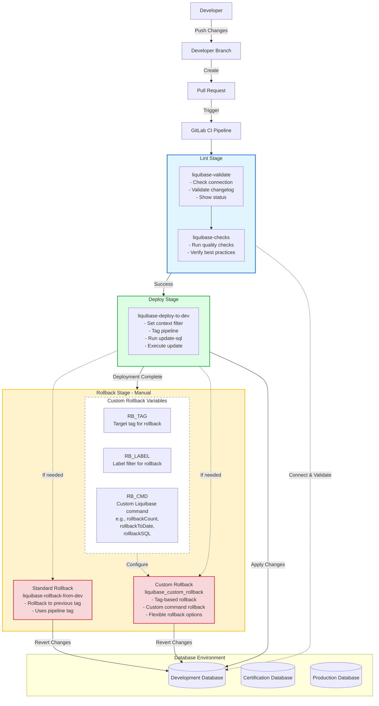

# Architecture Diagram - Liquibase CI/CD Pipeline

## High-Level Architecture Overview

This document provides a high-level architecture diagram of the Liquibase CI/CD pipeline with rollback capabilities.

## Pipeline Stages Breakdown

### 1. **Lint Stage** (Automated)
   - **liquibase-validate**: Validates the changelog syntax and database connection
   - **liquibase-checks**: Runs quality checks on the changelog and database
   - Runs automatically on all pipeline triggers (PR, push, merge, etc.)

### 2. **Deploy Stage** (Automated/Manual)
   - **liquibase-deploy-to-dev**: Deploys database changes to development environment
   - Creates a tag using `$CI_PIPELINE_ID`
   - Runs `update-sql` for preview and `update` for execution
   - Can be extended to cert and production environments (currently commented out)

### 3. **Rollback Stage** (Manual Only)
   - **Standard Rollback** (`liquibase-rollback-from-dev`):
     - Rolls back to the last pipeline tag
     - Runs `rollback-sql` for preview and `rollback` for execution
   
   - **Custom Rollback** (`liquibase_custom_rollback`):
     - Provides flexible rollback options via variables:
       - `RB_TAG` + `RB_LABEL`: Rollback to specific tag with label filter
       - `RB_CMD`: Execute any custom Liquibase rollback command
     - Examples of custom commands:
       - `rollbackCount <value>`: Rollback a specific number of changesets
       - `rollbackToDate <date>`: Rollback to a specific date
       - `rollbackSQL <tag>`: Generate rollback SQL without executing

## Workflow

1. **Developer** pushes code changes to a **developer branch**
2. **Pull Request** is created, triggering the GitLab CI pipeline
3. **Lint jobs** run automatically:
   - Validate changelog structure and syntax
   - Check database connectivity
   - Run quality checks
4. **Deploy job** runs (automatically or manually depending on configuration):
   - Tags the deployment with pipeline ID
   - Applies database changes via Liquibase update
5. **Rollback options** are available (manual trigger only):
   - **Standard rollback**: Quick rollback to previous tag
   - **Custom rollback**: Flexible rollback with custom parameters

## Key Features

- **Automated Validation**: Every PR triggers validation and checks
- **Tagging Strategy**: Each deployment creates a tag for easy rollback
- **Multiple Rollback Options**: Standard and custom rollback strategies
- **Environment Progression**: Designed for dev → cert → prod workflow
- **Manual Safety**: Rollback operations require manual approval
- **Flexible Custom Rollback**: Support for tag-based, count-based, date-based, and SQL-only rollbacks

## Environment Variables

### Standard Variables (per environment)
- `database_server`: Database server hostname
- `database_name`: Database name
- `database_username`: Database username
- `database_password`: Database password
- `database_type`: Type of database (azure_sql, mssql, postgresql)
- `env_context`: Environment context (dev, cert, prod)

### Custom Rollback Variables
- `RB_TAG`: Target tag for rollback (optional)
- `RB_LABEL`: Label filter for selective rollback (optional)
- `RB_CMD`: Custom Liquibase command for advanced rollback scenarios (optional)

## Usage Examples

### Standard Rollback
Simply trigger the `liquibase-rollback-from-dev` job manually from GitLab CI.

### Custom Rollback - By Tag and Label
1. Set variables in GitLab:
   - `RB_TAG`: "12345" (pipeline ID or custom tag)
   - `RB_LABEL`: "feature-x"
2. Trigger `liquibase_custom_rollback` job manually

### Custom Rollback - By Count
1. Set variables in GitLab:
   - `RB_CMD`: "rollbackCount 3"
2. Trigger `liquibase_custom_rollback` job manually

### Custom Rollback - By Date
1. Set variables in GitLab:
   - `RB_CMD`: "rollbackToDate 2025-01-15"
2. Trigger `liquibase_custom_rollback` job manually

### Generate Rollback SQL Only
1. Set variables in GitLab:
   - `RB_CMD`: "rollbackSQL <tag>"
2. Trigger `liquibase_custom_rollback` job manually
